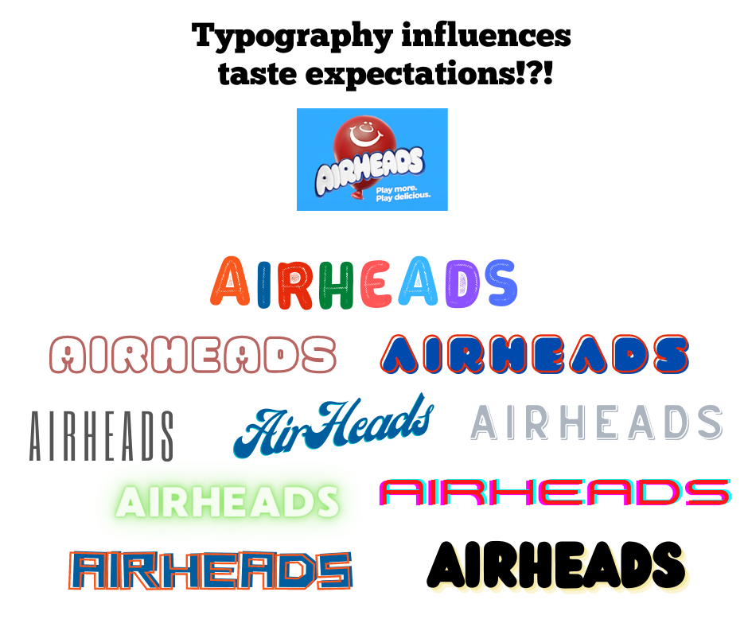

<!--StartFragment-->

Is it that foods use similar styles to other foods that came before—skinny for low calorie, handwritten for handmade, cartoonish for tasty and kid-friendly?

Think about if any of the above give you a pre-conception of what candy or other packaged food might taste like based on the typography. Then read on. Similar to colour and imagery, typography is one of the fundamental elements of a product packaging label. Typography helps to catch the consumer’s attention as well as convey the product information and company message. Your typography needs to create the proper tone to sell the product.

The researcher “discovered that angular, asymmetrical fonts make us perceive foods as sour, while we tie round, symmetrical writing to sweetness.”

When you shop for yourself or are doing food brand research, take a good look at the typography. 

* **Remember Less is More**

It’s a common theory when it comes to design and many forms of art that less is more. When designing a product packaging label, one of the significant details to consider is the choice of fonts. While you can have more than once, and you will generally see several on most packaging labels, you never want to exceed three. Two or three different fonts on your label is the most you should have. You need one specifically for all important documents, one for the product description, and then consider a third for any complimentary text.

* **It Reflects the Product Personality**

Much of the packaging label design is impacted by the choice of descriptive typography. All variations of typography have a style meant to create a particular feeling. This makes certain ones for products better than others. That means the typography chosen for the product is pivotal to conveying its personality and identity of it. If the item is supposed to be marketed to be a high-end product, you don’t want typography that presents a funny, bold, or boisterous tone. The same for the opposite.

* **Legibility is a Must**

A major part of the importance of typography in packaging labels is legibility. The ability of consumers to read your product labels is vital in several ways. Legibility should be one of the first details to consider when choosing your typography. It’s vital for marketing, branding, and consumer safety. If the typeface selected isn’t clear enough, switch it for one that is. Quality packaging of any product should include information that’s easy to read. If there is even a possibility of your typography not being legible, don’t use it. You’ll be at a complete disadvantage in conveying your message to the consumer, making it more likely your product will fail.

* **Don’t Forget to Contrast**

Contrast can be a beneficial detail for your consumer’s eye. This is because it makes every piece of product information easier to find and read. Examples of good contrast could be using similar typography but choosing styles such as bold, italic, and capital or lower-case letters. Consider combining a thick-edged font with a thin one for headers and subtitles. If these labels are also printed from a quality product label printer, you can be sure your contrasts will pop. While images on a product label help to convey your message, the combination of images and the written word will better ensure it’s not lost to the consumer.

<!--EndFragment-->