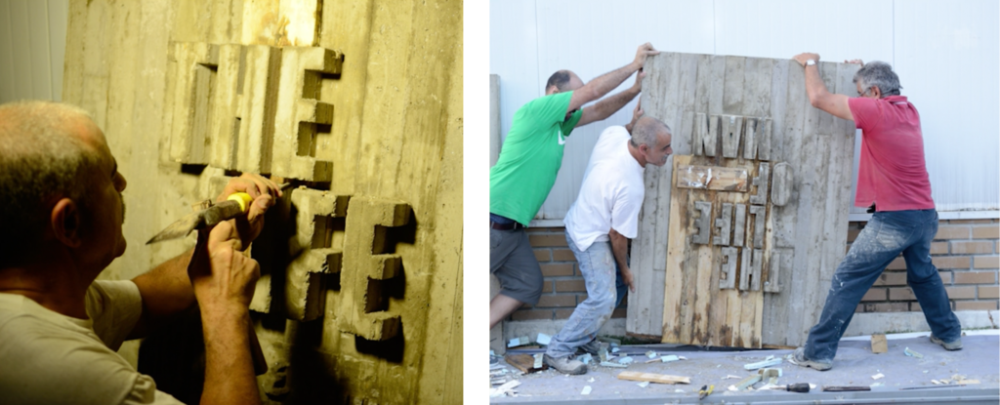

<!--StartFragment-->

Typography can invoke a feeling, remind you of a certain brand, or create an atmosphere. In branding, think about the boldness of the FedEx logo (with a sneaky hidden arrow!) or the classic blackletter style of The New York Times’ masthead. For editorial typesetting, think about the layout of your favourite magazine. And on your phone, think about how different fonts are used across different apps.

But when typography its bad, it can be jarring and distracting, even unreadable. Think about the last time you were confused by messy type in an app, were misled by unclear signage or struggled to understand an illegible pamphlet or packaging product. When you think about it, the art and science of typography is the basis of all communication such as logos, ad copy, headlines in magazines, and newspapers or chapter headings in a book.

Celebrating the artistry of the printed or written word, typography in the 21st Century is no longer defined into set categories. Spurred by an age of technological advancement, there is now an unprecedented range of experimentation and style in this field that seeks to explore a type that is bold, yet retains traditional elements. During the Industrial Revolution, the overwhelming prominence of machine-made objects brought a renewed interest in craft and the handmade. People began to feel dehumanized as their everyday lives became surrounded by machine goods. A similar effect is happening today with modern typography. 

Now, as most typefaces are produced digitally with vector software, this has caused a desire to return to illustrative or hand-drawn type. Recent trends in typography have even shifted away from digital presentations to creating text in the physical world out of tactile objects. We’ll take a closer look at some more experiments in today’s world of type.

### Back to Basics: The Written Word as Art

#### Handcraft Type

Handcraft has become a prominent trend where designers are creating fonts from physical materials. This font is all about taking dedicated time and careful effort into constructing these sculpture-like words that exist in the real world.

#### Photo-Based Illustrative Type

Similar to Handcraft Type, photographers that use this form of type manipulate objects from the real world. Whether it’s digitally rendering and editing type from certain objects or building and forming text from pre-existing objects, photo-based type pushes the boundaries of what the materiality of typography can be Action-Based Type

Action-Based Type is typically formed through a human motion or gesture. This type can also be created when text reacts to something in its designed environment.

### Pushing the Envelope: Experiments in Type

Designers with experimental type practices deliberately push the boundaries of legibility and take the text out of its role as a conveyor of information.

Combining the history of typography with today’s technological innovations brings countless ways to create words and visual forms. What kinds of text will you create?

<!--EndFragment-->