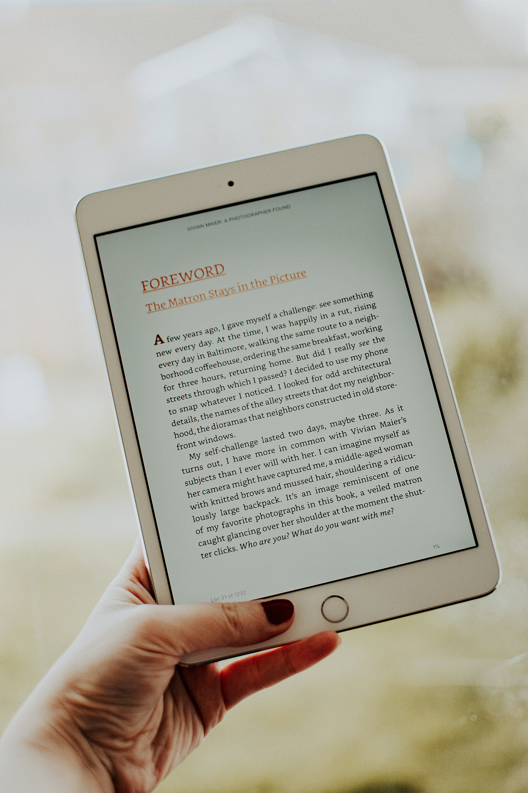

<!--StartFragment-->

## While it may not be obvious to most, text styles likely impact important cognitive processes and might make or break information retention.

Whenever you read a given text, your brain processes the visual stimuli to create meaning and understand the content. Chances are, you don’t pay much attention to the way the information is presented in the material — particularly the font choice — because your main objective is reading comprehension rather than aesthetics.

According to some studies, hard-to-read fonts such as Bodoni, Comic Sans, Haettenschweiler, or Monotype Corsiva are better for retaining information compared to fonts like Arial or Times New Roman. Participants recalled more information from the material they read when it was presented in a font that was difficult to read, according to a [2010 study](https://escholarship.org/uc/item/4wd1s7hj) published in Proceedings of the Annual Meeting of the Cognitive Science Society.

Additionally, a [2013 study](https://www.tandfonline.com/doi/abs/10.1080/00220671.2012.736430) in the Journal of Education Research found that this benefit also applies to students with dyslexia. This can appear counterintuitive, but in reality, the increased demand for mental processing may promote better attention toward the current task and improve the reader’s ability to retain information. 

Font characteristics such as style, size and colour play a role in information retention or recall, too, because font design is vital to our familiarity — or unfamiliarity — with a given word. Experiments have [demonstrated](https://link.springer.com/article/10.3758/s13421-018-0816-6) a U-shape relationship between font size and memory: large font items may [predict](https://pubmed.ncbi.nlm.nih.gov/26513175/) higher recall regardless of font style, but very small font sizes can also introduce a desirable difficulty.

A document’s specific method of formatting information also makes an impact. Using font styles like bold or italics to indicate significance in a given text can improve retention because people are better able to remember information, they consider important, says Oppenheimer. Researchers found that bolded text has a [higher recall](https://pubmed.ncbi.nlm.nih.gov/26513175/) than text in italic or regular styles, regardless of the font size. However, if an entire document is in bold, the emphasis is lost and readers can no longer spot vital passages.

Retention of information is also important in most circumstances. The applications of memory-enhancing typographic design based on psychological principles are massive, including specific use in childhood learning as well as dementia research.

For instance, distracting sounds like background chatter or environmental noise from aircraft and road traffic are shown to be [detrimental](https://www.frontiersin.org/articles/10.3389/fpsyg.2016.01196/full) to crucial parameters studied in students and office workers, like text memory, reading comprehension and [attentional function](https://hqlo.biomedcentral.com/articles/10.1186/s12955-020-01485-y). This finding prompted researchers to look into the effect of hard-to-read fonts — they learned that the increased engagement and task demand from the disfluency can significantly reduce one's processing of background noise. Ultimately, researching fonts’ impact on learning is one of the many ways we can explore the human mind.

<!--EndFragment-->