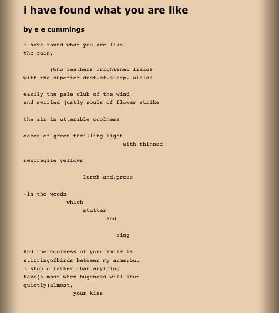
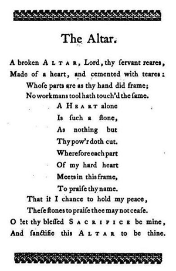

<!--StartFragment-->

In many forms of media, typography is commonly used in designs and other visuals to draw the public’s attention. Yet have you realized that poets also employ typography in their work? Is it only to capture the audience’s interest like the way designs and visuals do?

### **What is Typography in poetry?**

Typography in poetry, also known as graphic elements in poems, refers to the sort of punctuation and capitalization, the length of verses, the placement of phrases, and even blank space.

### **Influences of typography in poems**

Typography not only affects the visuals of poems but also emphasizes their messages. The audience, not only are they readers of the poems but also viewers of the pictures.

### Examples of typography in poetry

E.E. Cummings is a notable author who is famous for visual concrete works. He employs most typographical elements including line length, space and punctuation, and poem shape. The poet is described to “free the word from its grapheme, and put its formal, visual, and phonetic elements into focus.”

Some examples of typography in E.E. Cumming poems are:

* ### “Me up at does”

Each sentence is only four lines long, giving the poetry a jagged appearance that conveys the subject’s sentiments about what he did. Though no phrases in the verse express his sense of guilt directly, the idea is conveyed clearly based on how the poem is written. Since his thinking is fragmented and inconsistent, the rhyme is broken up.

* ### “I have found what you are like”

Our mind sees this poetry through a whole different lens because of the way it was written. We can almost grasp the concept of the woods stumbling and singing. Even if it isn’t portraying a genuine scenario, we get the impression that we can see it and that it is real.

* ### “The Altar” by George Herbert

The Altar by George Herbert

George Herbert is another poet known for metaphysical writings. The poem is shaped like an altar, depicting the metaphorical process of making an altar out of one’s own heart.

* ### “In a Station of the Metro” by Ezra Pound

Poet Ezra Pound was an advocate of the movement of imagist poetry. Many believe “In a Metro Station” to be a typical illustration of typography in poetry. The poem is brief, has no verbs but emphasizes graphic spacing instead, providing the reader with an image of a passing train.

“The apparition of these faces in the crowd:

Petals on a wet, black bough.”

The poem was initially printed with spaces between the two lines to simulate train tracks and highlight the verse’s flow. Pound makes an implied comparison between the scene of faces going through the station and a lovely vision of nature, underlining the beauty of even the most inconsequential of events.

<!--EndFragment-->